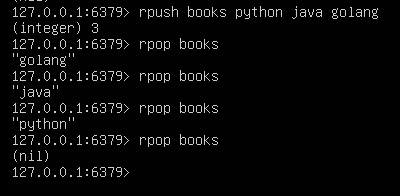
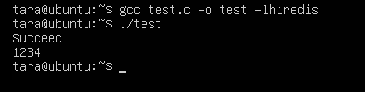

# 任务
## 学习redis数据库的使用
### 基础数据结构
#### string
- 用途广泛，如缓存用户信息。使用JSON序列化成字符串，然后将序列化后的字符串塞进Redis缓存，取用户信息会经过一次反序列化过程。

#### list
- list插入删除操作非常快，时间复杂度为$O(1)$,索引定位很慢为O(n)。

- Redis的列表结构常用来做异步队列使用。将需要延后处理的任务结构体序列化成字符串塞进Redis的列表，另一个线程从这个列表中轮询数据进行处理。

#### hash
- 无序字典

- 内部实现：数组+链表二维结构

#### set
- 内部的键值对是无序的唯一的(去重)
- 内部实现相当于一个特殊的字典，字典中所有的value都是一个值NULL

## 学习C语言redis组件hiredis；

运行结果

