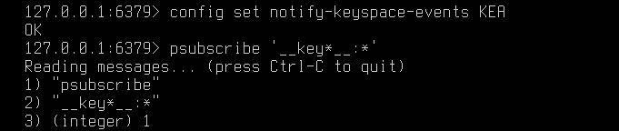
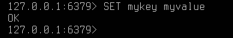
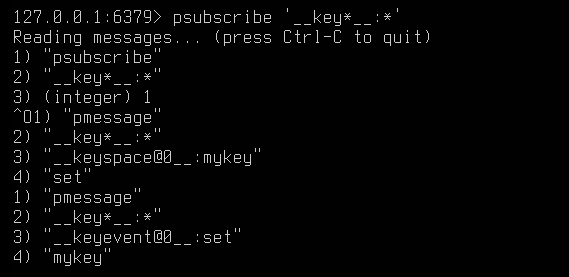
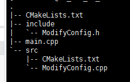
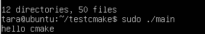
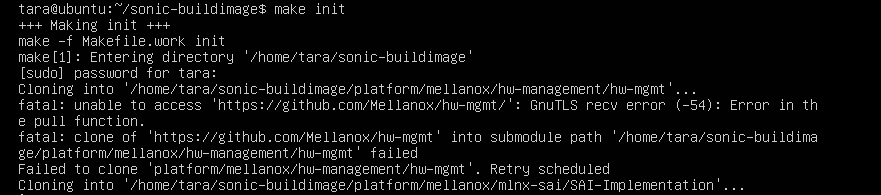

# 1. redis keyspace notification机制学习
## keyspace notification
### Configuring keyspace notification
-  运行时

```
127.0.0.1:6379> CONFIG SET notify-keyspace-events KEA
OK
```

- 修改设置文件(永久)
在文件 /etc/redis/redis.conf 中找到 notify-keyspace-events "" 并修改为 notify-keyspace-events KEA

```console
sudo nano /etc/redis/redis.conf
notify-keyspace-events KEA
```

### Testing Keyspace Notification
Terminal 1:



Terminal 2:



Terminal 1:


# 2. makefile/cmake使用学习，输出学习笔记
## 概念
`makefile`文件描述了整个工程的编译、链接等规则。

`cmake`是跨平台的编译工具，用来生成makefile文件

`make`可以看成是一个智能的批处理工具，本身并没有编译和链接的功能，用类似于批处理的方式通过调用makefile中用户指定的命令来进行编译和链接。解释makefile中指令的命令工具。

## 运行
### cmake生成makefile
1. 目录层级关系

    
    ```txt
    // CMakeLists.txt
    cmake_minimum_required(VERSION 2.8)//代表CMake的最低版本
    project(cmakeTest)
    aux_source_directory(. DIR_SRCS)//将当前目录的源文件名赋值给DIR_SRCS
    include_directories(./include)
    add_subdirectory(src)
    add_executable(main ${DIR_SRCS})
    target_link_libraries(main source_lib)
    ```

2. 执行cmake CMakeLists.txt
3. 执行make

    

## sonic image
步骤
```
git clone https://github.com/Azure/sonic-buildimage.git

sudo modprobe overlay

cd sonic-buildimage

git checkout [branch_name]

make init

make configure PLATFORM=broadcom

make SONIC_BUILD_JOBS=4 all

```

