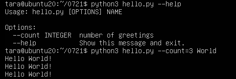
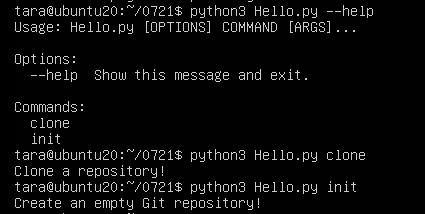
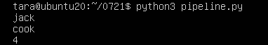

## 用click框架编写python程序
```python
import click

@click.command()
@click.option('--count', default=1, help='number of greetings')
@click.argument('name')
def hello(count, name):
    """Simple program that greets NAME for a total of COUNT times."""
    for x in range(count):
        click.echo('Hello %s!' % name)

if __name__ == '__main__':
    hello()
```
运行结果：




Click 通过 group 装饰器来创建一个命令组，将一个复杂的命令行进行解耦，将不同的逻辑放在不同的命令中。
```python
# -*- coding:utf-8 -*-
import click


@click.group()
def git():
    '''These are common Git commands used in various situations:'''
    pass

@git.command()
def clone():
    '''Clone a repository into a new directory'''
    click.echo('Clone a repository!')

@git.command()
def init():
    '''Create an empty Git repository or reinitialize an existing one'''
    click.echo('Create an empty Git repository!')

if __name__ == '__main__':
    git()
```



## python调用redis

redis默认在执行每次请求都会创建（连接池申请连接）和断开（归还连接池）一次连接操作，如果想要在一次请求中指定多个命令，则可以使用pipline实现一次请求指定多个命令，并且默认情况下一次pipline 是原子性操作。

管道（pipeline）是redis在提供单个请求中缓冲多条服务器命令的基类的子类。它通过减少服务器-客户端之间反复的TCP数据库包，从而大大提高了执行批量命令的功能。

```python
import redis
import time

pool = redis.ConnectionPool(host='localhost', port=6379, decode_responses=True)
r = redis.Redis(connection_pool=pool)

pipe = r.pipeline() # 创建一个管道

pipe.set('name', 'jack')
pipe.set('role', 'sb')
pipe.sadd('faz', 'baz')
pipe.incr('num')    # 如果num不存在则vaule为1，如果存在，则value自增1
pipe.execute()

print(r.get("name"))
print(r.get("role"))
print(r.get("num"))
```

运行结果：
