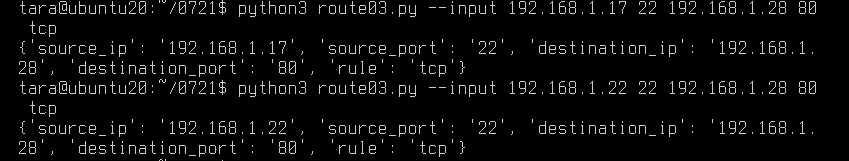

## 用python click，输入命令行，然后用命令行操作redis

通过 key(用户ID) + field(属性标签) 就可以操作对应属性数据了，既不需要重复存储数据，也不会带来序列化和并发修改控制的问题。


```python
import redis
import click

pool = redis.ConnectionPool(host='localhost', port=6379, decode_responses=True)
r = redis.Redis(connection_pool=pool)
pipe = r.pipeline() # 创建一个管道

@click.command()
@click.option('--input', nargs=2, type=str)

def input_route(input):
    """Simple program that greets NAME for a total of COUNT times."""
    source_ip = input[0]
    route = list(input)
    name = ["source_ip", "source_port", "destination_ip", "destination_port", "rule"]#源IP地址，源端口，目的IP地址，目的端口，传输层协议
    dict = zip(name, route)
    for key, value in dict:
        r.hset("ip:"+str(source_ip), key, str(value))#以源ip作为匹配字段

    pipe.execute()
    
    print(r.hgetall("route_hash"))

if __name__ == '__main__':
    input_route()

```

运行结果


## GNU Autotools
### Autotools工作方式
1. 首先，在./configure步骤中，Autotools扫描宿主机系统(即当前正在运行的计算机)以发现默认设置。默认设置包括支持库所在的位置，以及新软件应放在系统上的位置。
2. 接下来，在make步骤中，Autotools通常通过将人类可读的源代码转换为机器语言来构建应用程序。
3. 最后，在make install步骤中，Autotools将其构建好的文件复制到计算机上(在配置阶段检测到)的相应位置。
### Autotools的优势
- 可移植性
- 打包
### 如何使用 Autotools
#### Autotools 的组件是：
- automake
- autoconf
- automake
- make

#### Autotools 项目结构
GNU Autotools 有非常具体的预期规范。首先，源代码本身应该位于一个名为 src 的子目录中。

此外，这些文件是必需的：
- NEWS
- README
- AUTHORS
- ChangeLog

#### Autotools 配置
在项目根目录下创建一个名为 configure.ac 的文件。autoconf 使用此文件来创建用户在构建之前运行的 configure shell 脚本。该文件必须至少包含 AC_INIT 和 AC_OUTPUT M4 宏。
#### 生成 Autotools Makefile
Autotools并不能检测项目构建所需的所有内容，因此必须在文件Makefile.am 中添加一些细节，然后在构造Makefile 时由automake 使用。

Makefile.am 使用与 Makefile 相同的语法。通常，Makefile.am 文件只需要几个变量定义来指示要构建的文件以及它们的安装位置即可。


#### 生成 Autotools 构建脚本
构建者通常使用这个众所周知的顺序：
```s
$ ./configure
$ make
$ sudo make install
```
#### 去使用 Autotools
尝试：[autotools_hello](https://github.com/aggresss/playground-cpp/tree/master/project/autotools/autotools_hello)

使用autogen.sh 去生成configure,config.h.in,Makefile.in 等文件，使用autoremove.sh 重新初始化文件
```s
#!/bin/sh
# cat autogen.sh
aclocal && \
    autoheader && \
    libtoolize && \
    autoconf && \
    touch NEWS README AUTHORS ChangeLog && \
    automake --add-missing --force-missing --copy
```
执行流程：

- 执行autoscan命令。这个命令主要用于扫描工作目录，并且生成configure.scan文件；
- 修改configure.scan为configure.ac文件，并且修改配置内容，语法参考Autoconf文档；
- 执行aclocal命令。扫描configure.ac文件生成aclocal.m4文件；
- 执行autoheader命令。生成config.h.in文件；
- 执行libtoolize命令。如果生成库文件需要用到这一步骤；
- 执行autoconf命令。将configure.ac文件中的宏展开，生成configure脚本；
- 新增Makefile.am文件，修改配置内容，语法参考Automake文档和Libtool文档；
- 执行automake命令。生成Makefile.in文件；
经过上面的8个步骤在工程目录下就会生成configure, config.h.in, Makefile.in 三个文件，接下来就是经典的 ./configure -> make -> make install了。
