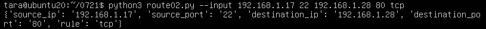

## 用python click，输入命令行，然后用命令行操作redis
```python
import redis
import click

pool = redis.ConnectionPool(host='localhost', port=6379, decode_responses=True)
r = redis.Redis(connection_pool=pool)
pipe = r.pipeline() # 创建一个管道

@click.command()
@click.option('--input', nargs=2, type=str)

def input_route(input):
    """Simple program that greets NAME for a total of COUNT times."""
    #(source_ip, source_port, destination_ip, destination_port, rule) = input
    route = list(input)
    name = ["source_ip", "source_port", "destination_ip", "destination_port", "rule"]#源IP地址，源端口，目的IP地址，目的端口，传输层协议
    dict = zip(name, route)
    for key, value in dict:
        r.hset("route_hash", key, str(value))

    pipe.execute()
    
    print(r.hgetall("route_hash"))

if __name__ == '__main__':
    input_route()

```

运行结果


## GNU libtool
- 库开发过程的抽象
- 库编译过程的抽象
- 目标文件的抽象
- 可执行文件的抽象