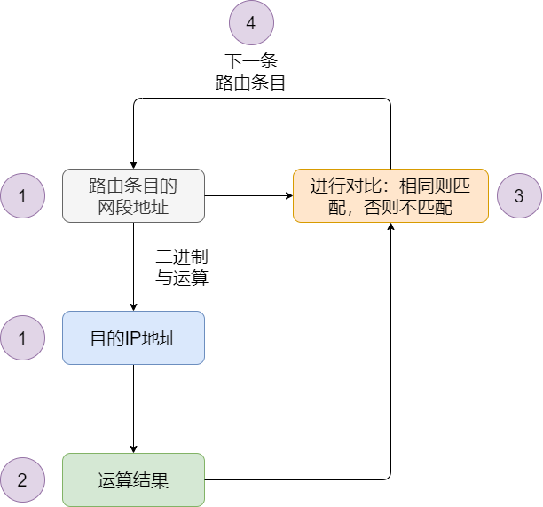
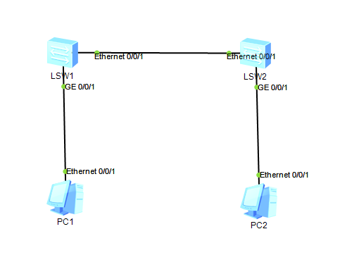
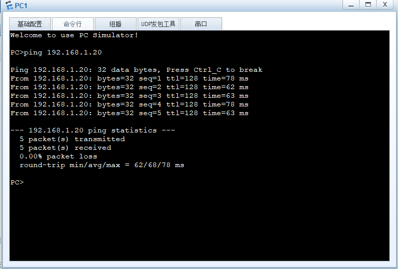
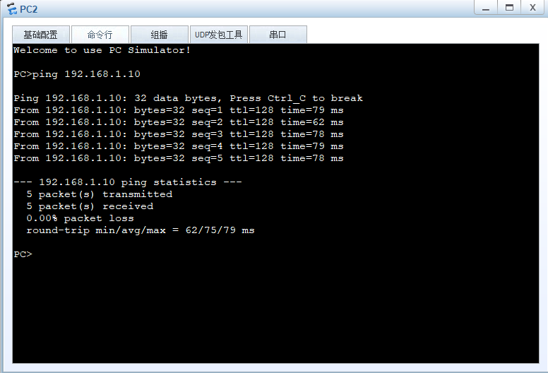

# 二层转发原理
交换机有多个网络端口，它通过识别数据帧的目标 MAC 地址，根据 MAC 地址表决定从哪个端口发送数据。MAC 地址表不需要在交换机上手工设置，而是可以自动生成的。

## 交换机是如何添加、更新、删除 MAC 地址表条目的？

在初始状态下，交换机的 MAC 地址表是空的，不包含任何条目。当交换机的某个端口接收到一个数据帧时，它就会将这个数据帧的`源 MAC 地址、接收数据帧的端口号`作为一个条目保存在自己的 MAC 地址表中，同时在接收到这个数据帧时重置这个条目的老化计时器时间。这就是交换机自动添加 MAC 地址表条目的方式。

在新增这一条 MAC 地址条目后，如果交换机再次从同一个端口收到相同 MAC 地址为源 MAC 地址的数据帧时，交换机就会更新这个条目的老化计时器，确保活跃的的条目不会老化。但是如果在`老化时间`内都没收到匹配这个条目的数据帧，交换机就会将这个老化的条目从自己的 MAC 地址表中删除。

还可以手动在交换机的 MAC 地址表中添加静态条目。静态添加的 MAC 地址条目优先动态学习的条目进行转发，而且`静态条目没有老化时间`，会一直保存在交换机的 MAC 地址表中。

## 如何使用 MAC 地址表条目进行转发？ 

当交换机的某个端口收到一个单播数据帧时，它会查看这个数据帧的二层头部信息，并进行两个操作。一个操作是根据源 MAC 地址和端口信息添加或更新 MAC 地址表。另一个操作是查看数据帧的目的 MAC 地址，并根据数据帧的目的 MAC 地址查找自己的 MAC 地址表。在查找 MAC 地址表后，交换机会根据查找结果对数据帧进行处理，这里有 3 中情况：
1. 交换机没有在 MAC 地址表中找到这个数据帧的目的 MAC 地址，因此交换机不知道自己的端口是否有连接这个 MAC 地址的设备。于是，交换机将这个数据帧从`除了接收端口之外的所有端口泛洪出去`。

2. 交换机的 MAC 地址表中有这个数据帧的目的 MAC 地址，且对应端口不是接收到这个数据帧的端口，交换机知道目的设备连接在哪个端口上，因此交换机会根据 MAC 地址表中的条目将数据帧从对应端口`单播`转发出去，而其它与交换机相连的设备则不会收到这个数据帧。

3. 交换机的 MAC 地址表中有这个数据帧的目的 MAC 地址，且对应端口就是接收到这个数据帧的端口。这种情况下，交换机会认为数据帧的目的地址就在这个端口所连接的范围内，因此目的设备应该已经收到数据帧。这个数据帧与其它端口的设备无关，不会将数据帧从其它端口转发出去。于是，交换机会`丢弃数据帧`。

补充：

- 单播：主机一对一的发送数据。单播地址是主机的 MAC 地址。
- 广播：向局域网内所有设备发送数据。只有全 1 的 MAC 地址为广播 MAC 地址，即 FF-FF-FF-FF-FF-FF 。 
- 泛洪：将某个端口收到的数据从除该端口之外的所有端口发送出去。泛洪操作广播的是普通数据帧而不是广播帧。

# 三层转发原理

路由器有多个端口，分别连接不同的数据链路。它通过识别目的IP地址的`网络号`，再根据路由表进行转发，路由表中有匹配的路由条目才会转发，无匹配的路由条目则直接丢弃。路由条目既可以手动设置静态路由，也可以通过路由协议自动生成动态路由。



路由器如何进行三层转发？
1. 对数据包进行解封装
通过解封装，查看网络层头部信息的目的IP地址

2. 在路由表中查找匹配的路由条目
查找匹配的路由条目，就需要将数据包的目的 IP 地址与各个路由条目的网段地址先进行二进制与（ AND ）运算，再将运算结果与路由条目的网段地址进行比较，若一致则该条目与目的 IP 地址相匹配。最后，与所有路由条目完成运算和比较，可得到一条或多条相匹配的路由条目。也可能没有匹配的路由条目，那么丢弃数据包

3. 从多个匹配项中选择掩码最长的路由条目。如果路由表中有多条路由条目都匹配数据包的目的 IP 地址，则路由器会选择掩码长度最长的路由条目，这种匹配方式称为最长匹配原则。例如：10.1.3.10 的网络地址与 10.1.3.0/16 和 10.1.3.0/24 两项都匹配，这时应该选择匹配度最长的 10.1.3.0/24 。

4. 将数据包按照相应路由条目进行转发。
路由条目中包含下一跳和出接口。当路由器找到相应的路由条目后，它就会根据对应的下一跳和出接口，将数据包从出接口发送数据给下一跳设备。

## ARP
只要确定了 IP 地址，就可以向这个目标地址发送 IP 数据报文。但是在进行实际通信时，还要知道每个 IP 地址所对应的 MAC 地址。

地址解析协议，简称 ARP 协议。是根据目的设备的 IP 地址来查询对应 MAC 地址的协议。

### ARP 的工作原理
当主机 A 向同一个网段内的主机 C 发送数据，但是不知道主机 C 的 MAC 地址。

1. ARP 请求：主机 A 以主机 C 的 IP 地址为目的 IP 地址，以广播 MAC 地址为目的 MAC 地址，在同网段内发送这个广播报文，这个报文就叫 ARP 请求报文。二层交换机不查看 IP 地址，根据目的 MAC 地址将报文除接收端口外的所有端口发送。

2. ARP 响应：主机 C 发现目的 IP 地址是自己的 IP 地址，于是主机 C 以自己 MAC 地址和 IP 地址作为源 MAC 地址和源 IP 地址，以主机 A 的 MAC 地址和 IP 地址作为目的 MAC 地址和目的 IP 地址，发送响应报文给主机 A ，这个报文就叫 ARP 响应报文。其它主机收到主机 A 的 ARP 请求报文，因为目的 IP 地址不是自己的 IP 地址，因此不会进行响应。

    当主机 A 在发送 ARP 广播请求报文时，二层交换机已经有主机 A 的 MAC 地址表条目。当收到主机 C 发送的单播 ARP 响应报文时，二层交换机将报文从相应端口发送出去。并将主机 C 的 MAC 地址和对应端口记录到 MAC 地址表中。


3. 更新 ARP 缓存表：主机 A 收到 ARP 响应报文后，将主机 C 的 IP 地址和 MAC 地址记录到 ARP 缓存表中。下次再向主机 C 发送数据时，直接将缓存的目的 MAC 地址进行封装。

4. 当主机 A 向不同网段的主机 C 发送数据，但是不知道主机 C 的 MAC 地址。

- 主机 A 使用主机 C 的 IP 地址查询 ARP ，ARP 发现主机 C 不在同一个网段，需要通过默认网关（即默认路由的下一跳地址），但是没有网关 MAC 地址；

- 主机 A 先将发送给主机 C 的数据放入缓存中，然后发送 ARP 请求报文，主机 A 以网关 IP 地址为目的 IP 地址发送 ARP 广播请求报文；

- 路由器收到 ARP 广播请求报文后，将主机 A 的 MAC 地址和对应端口添加到自己的 MAC 表中，然后查看目的 IP 地址发现是请求自己的 MAC 地址，于是单播发送 ARP 响应报文；

- 主机 A 收到 ARP 响应报文后，将发送给主机 C 的数据封装网关 MAC 地址为目的 MAC 地址进行发送；

- 路由器收到报文后，查看目的 IP 地址，是发送给主机 C 的，于是查询路由表从相应端口发送数据。由于没有主机 C 的 MAC 地址，路由器发送 ARP 请求报文，源 MAC 地址和源 IP 地址替换为发送端口的MAC 地址和 IP 地址；

- 主机 C 收到 ARP 请求报文后，添加路由器的端口和 MAC 地址到 MAC 地址表，单播发送 ARP 响应报文；

- 路由器收到主机 C 的 MAC 地址后，将其添加到 MAC 地址表中。将主机 A 发送给主机 C 的报文重新封装，以自己的 MAC 地址为源 MAC 地址，以主机 C 的 MAC 地址为目的 MAC 地址，发送给主机 C ；

- 主机 C 收到主机 A 发送的数据，发送过程结束。

当主机 C 向主机 A 发送回复报文时，同主机 A 向主机 C 发送数据的步骤一致。

# 路由器：

路由器工作于OSI七层协议中的第三层，其主要任务是接收来自一个网络接口的数据包，根据其中所含的目的地址，决定转发到下一个目的地址。因此，路由器首先得在转发路由表中查找它的目的地址，若找到了目的地址，就在数据包的帧格前添加下一个MAC地址，同时IP数据包头的TTL（Time To Live）域也开始减数，并重新计算校验和。当数据包被送到输出端口时，它需要按顺序等待，以便被传送到输出链路上。

路由器在工作时能够按照某种路由通信协议查找设备中的路由表。如果到某一特定节点有一条以上的路径，则基本预先确定的路由准则是选择最优（或最经济）的传输路径。由于各种网络段和其相互连接情况可能会因环境变化而变化，因此路由情况的信息一般也按所使用的路由信息协议的规定而定时更新。

# ENSP模拟二层交换


## LSW1的配置
```s
<Huawei>system-view

[Huawei]sysname LSW1

[LSW1]vlan batch 2# 在vlan后面加上一个batch，可以批量的创建多个vlan

[LSW1]interface Ethernet0/0/1

[LSW1-Ethernet0/0/1]port link-type trunk# 两个交换机之间用trunk口进行配置)

[LSW1-Ethernet0/0/1]port trunk allow-pass vlan 2

[LSW1-Ethernet0/0/1]quit

[LSW1]interface gigabitethernet0/0/1

[LSW1-Gigabitethernet0/0/1]port link-type access# Access端口是交换机上用来连接用户主机的端口，它只能连接接入链路，并且只能允许唯一的VLAN通过本端口）

[LSW1-Gigabitethernet0/0/1]port default vlan 2

[LSW1-Gigabitethernet0/0/1]quit
```

## LSW2上的配置
```s
<Huawei>system-view

[Huawei]sysname LSW2

[LSW2]vlan batch 2

[LSW2]interface ethernet0/0/1

[LSW2-Ethernet0/0/1]port link-type trunk

[LSW2-Ethernet0/0/1]port trunk allow-pass vlan 2

[LSW2-Ethernet0/0/1]quit

[LSW2]interface gigabitethernet0/0/1

[LSW2-Gigabitethernet0/0/1]port link-type access

[LSW2-Gigabitethernet0/0/1]port default vlan 2

[LSW2-Gigabitethernet0/0/1]quit
```
## 配置PC
PC1: 192.168.1.10

pc2: 192.168.1.20

## RESULT
### PC1

### PC2
