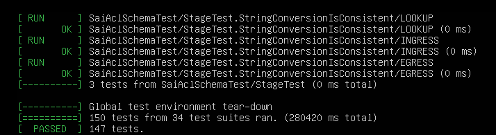

# SONiC CLI

## 查看VLAN 配置
```s
root@4dd09021bcae:/# show vlan config
Name  VID  Member  Mode
------  -----  ---------  --------
Vlan10  10  Ethernet1  untagged
Vlan15  15  Ethernet0  untagged

```

## 查看路由表
```s
root@4dd09021bcae:/# show ip route
Command: sudo vtysh -c "show ip route"
sudo: unable to resolve host 4dd09021bcae
Codes: K - kernel route, C - connected, S - static, R - RIP,
  O - OSPF, I - IS-IS, B - BGP, P - PIM, A - Babel,
  > - selected route, * - FIB route
 
C>* 10.0.0.0/31 is directly connected, Vlan15
C>* 127.0.0.0/8 is directly connected, lo
C>* 192.168.1.0/24 is directly connected, Vlan10
B>* 192.168.2.0/24 [20/0] via 10.0.0.1, Vlan15, 00:54:18
```

## 初始化配置
```s
root@4dd09021bcae:/# cat /etc/sonic/config_db.json
{
  "VLAN_INTERFACE": {
  "Vlan10|192.168.1.1/24": {},
  "Vlan15|10.0.0.0/31": {}
  },
  "VLAN": {
  "Vlan10": {
  "members": [
  "Ethernet1"
  ],
  "vlanid": "10"
  },
  "Vlan15": {
  "members": [
  "Ethernet0"
  ],
  "vlanid": "15"
  }
  },
  "VLAN_MEMBER": {
  "Vlan10|Ethernet1": {
  "tagging_mode": "untagged"
  },
  "Vlan15|Ethernet0": {
  "tagging_mode": "untagged"
  }
  },
  "DEVICE_METADATA": {
  "localhost": {
  "mac": "00:01:04:4c:49:f5"
  }
  }
}
```
## Redis查看数据
```s
root@993e023be080:/# redis-cli
127.0.0.1:6379> keys ROUTE_TABLE*
1) "ROUTE_TABLE:192.168.2.0/24"
2) "ROUTE_TABLE:127.0.0.0/8"
3) "ROUTE_TABLE:10.0.0.0/31"
4) "ROUTE_TABLE:192.168.1.0/24"
127.0.0.1:6379> hgetall "ROUTE_TABLE:192.168.2.0/24"
1) "nexthop"
2) "10.0.0.1"
3) "ifname"
4) "Vlan15"
127.0.0.1:6379> hgetall "ROUTE_TABLE:10.0.0.0/31"
1) "nexthop"
2) ""
3) "ifname"
4) "Vlan15"
127.0.0.1:6379> hgetall "ROUTE_TABLE:192.168.1.0/24"
1) "nexthop"
2) ""
3) "ifname"
4) "Vlan10"
```
可见在switch1上，有三条路由:

192.168.2.0/24: 下一跳是10.0.0.1, 出接口是vlan15

192.168.1.0/24: 直连路由，出接口是vlan10.

10.0.0.0/31: 直连路由，出接口是vlan15.

# SWSS
SONIC 使用 SWSS（switch state service）来充当 ASIC 的控制模块，通过数据库来连接网络应用程序和硬件交换机进行通信以及状态的更新,用于与网络应用程序和网络交换机硬件进行通信并进行状态表示。SwSS允许在SONiC上运行的网络应用程序完全独立于它们所运行的硬件。SWSS 为 SONIC 提供了数据接口。
## Build with Google Test
```s
$ ./autogen.sh
$ ./configure --enable-debug 'CXXFLAGS=-O0 -g'
$ make clean
$ GCC_COLORS=1 make

sudo sed -i 's/notify-keyspace-events ""/notify-keyspace-events AKE/' /etc/redis/redis.conf
sudo service redis-server start

tests/tests
```
