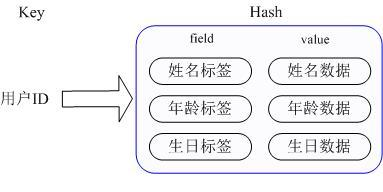

# 模块A
路由配置模块，python语言实现，将路由通过python click录入redis 0库；
## 实现思路
### 选择合适的Redis数据类型
通过 key(用户ID) + field(属性标签) 就可以操作对应属性数据了，既不需要重复存储数据，也不会带来序列化和并发修改控制的问题。


### 对应路由的查看、删除、增加分别需要hash的查看、删除、增加
查看 hgetall
删除 del
增加 hset/hmset
## 过程
### 对应路由的查看、删除、增加分别需要hash的查看、删除、增加
查看 hgetall

```python
def check(source_ip):
    print(r.hgetall("ip:"+str(source_ip)))
```

删除 del

```python
def delete(source_ip):
    r.delete("ip:"+str(source_ip))
```

增加 hset/hmset

```python
def new(input):
    """Simple program that greets NAME for a total of COUNT times."""
    source_ip = input[0]
    route = list(input)
    name = ["source_ip", "source_port", "destination_ip", "destination_port", "rule"]#源IP地址，源端口，目的IP地址，目的端口，传输层协议
    dict = zip(name, route)
    for key, value in dict:
        r.hset("ip:"+str(source_ip), key, str(value))#以源ip作为匹配字段
    pipe.execute()
```
## 结果
运行结果

# 模块B
路由应用模块，c/c++语言实现，监听redis 0库中的路由变化，将路由同步到redis 1库；
## 思路
首先需要订阅redis 0的路由变化；
并且需要将结果同步到redis 1;
## 过程
订阅redis 0中路由的变化可采用redis keyspace notification机制实现。

首先需要设置：
```
127.0.0.1:6379> CONFIG SET notify-keyspace-events KEA
OK
```
主要实现函数：
```cpp
     string command ("psubscribe __key*@0__:*");
     //command.append(args[2]);

     status = redisAsyncCommand(_redisContext, 
           subCallback, 
           (char*)"sub", command.c_str()); 
```

subCallback将订阅到的ip在redis 0中进行查询，并根据订阅到的操作来插入/删除到redis 1中
```cpp
void subCallback(redisAsyncContext *c, void *r, void *privdata) {

  redisReply *reply = (redisReply*)r;
  if (reply == NULL){
    cout<<"Response not recev"<<endl; 
    return;
  }
  //cout << reply[0]->type <<" " << reply->elements<<endl;
  if(reply->type == REDIS_REPLY_ARRAY & reply->elements == 4)
  {
    if(strcmp( reply->element[0]->str,"subscribe") != 0)
    {
	  cmd = reply->element[3]->str;
	  key = reply->element[2]->str;
	  int n = key.size();
	  key = key.substr(15, n-15);
/*       cout<<"Message received -> "<<
        reply->element[3]->str<<" "<< reply->element[2]->str<<"( on channel : "<<reply->element[1]->str<<")"<<endl; */
	  cout << cmd << ' '<<key<<endl;
    }
	
	string checkcmd("hgetall ");
	checkcmd.append(key);
	redisReply *reply_check=(redisReply*)redisCommand(rc, checkcmd.c_str());
	
	int n = reply_check->elements;
	vector<string> keys;
	vector<string> values;

	for(int i=0; i<n;i=i+2){
		string _key (reply_check->element[i]->str);
		string _val (reply_check->element[i+1]->str);
		//cout << _key <<" "<< _val <<endl;
		keys.push_back(_key);
		values.push_back(_val);
	}
	//string start ("multi");
	//string end ("exec");
	//redisAppendCommand(rc, start.c_str());

	string changecmd ("select 1");
	//redisReply *reply_set=(redisReply*)redisCommand(rc, changecmd.c_str());
	redisAppendCommand(rc, changecmd.c_str());
	string strCmd;
	if(cmd == "hset"){
		strCmd = "hmset ";

		//cout << strCmd <<endl;
		strCmd += key;
    
		for(int i = 0; i < keys.size(); i++)
		{
			strCmd += " "+keys[i]+" "+values[i];
		}
		//cout << strCmd <<endl;		
	}
	else if(cmd =="del"){
		strCmd = "del ";
		strCmd += key;		
	}
```


## 结果
```s
cmake CMakeLists.txt
sudo make
./pub sub
```
监听状态

增加路由

增加路由后redis 1库中变化

删除路由

删除路由后redis 1库中变化

# 模块C
路由检测模块，python语言实现，每15min检测redis
## 思路
ping3模块中的ping命令可以检测路由；
schedule模块可以设置每15min运行一次函数；

## 过程
ping3模块中的ping命令可以检测路由，如
```python
ping('14.215.177.39')
```
schedule模块可以设置每15min运行一次函数,具体实现如下：
```python
schedule.every(15).minutes.do(run)    # 每隔十分钟执行一次任务
while True:
    schedule.run_pending()  # run_pending：运行所有可以运行的任务
```
插入相关数据到redis 2并设置expire时间为1小时
```python
def run():
    pool=redis.ConnectionPool(host='127.0.0.1',port=6379,db=1)
    r = redis.StrictRedis(connection_pool=pool)
    target_redis = redis.Redis(host='127.0.0.1', port=6379, db=2)
    keys = r.keys()
    for key in keys:
        print(key)
        res = ping(key[3:])#14.215.177.39
        SSIM = ScalarMetric()
        if(res):
            SSIM.update(res)
            target_redis.hset(key, "available", "Yes")
            target_redis.hset(key, "Time", float(res))
            target_redis.expire(key, 3600)
        else:
            target_redis.hset(key, "available", "No")
            target_redis.hset(key, "Time", 0.0)
            target_redis.expire(key, 3600)
```
## 结果


